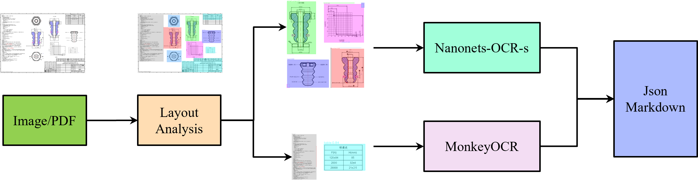

# Resume

--- 

📧 **邮箱**：1023010418@njupt.edu.cn  📞 **电话**：+86 15212147511 

## 个人评价

面试官您好，我是 **梁宇恒**，就读南京邮电大学信号与信息处理专业，在智能信息处理与通信技术省高校重点实验室（智通实验室），研究生期间获得研究生学业一等奖学金。

科研方面，主要研究方向为**多模态情感识别**，所提出方法在2025年第八届CVPRworkshop国际竞赛中获得**第六名**(全球75支队伍)，论文被收录CVPRworkshop。同时以第一作者身份发表多模态情感识别相关成果论文**3篇**。

项目实践方面，有过两段AI算法实习经历，熟悉主流的深度学习框架（PyTorch）、编程语言（Python/C++）、开发工具链（Linux、Shell、Docker），能够独立完成从方法设计、训练优化、微调到部署上线的完整流程。具备良好的问题分析能力、说明文档撰写能力、部门协作能力。

本人衷心热爱人工人工智能领域研究与实践，具备扎实的**计算机视觉**、**多模态大模型**、**多模态RAG**等实践经验，具备从理论研究到工程化落地的能力链。下面是我科研成果与实践项目的详细说明，期待与您进一步沟通。

---

## 实习经历 
### 鼎捷数智股份有限公司(南京研发中心)-AI算法工程师 | 2025.05-2025-09
#### 基于大模型的复杂工程图纸解析

- **项目简介**：开发基于大模型的工程图纸解析系统，利用YOLOv11进行版面检测（识别剖面图、工装图、刻字图/内容、压力曲线图、文本块、表格块、切面图等7类元素），并通过微调后的Nanonets-OCR-s模型对各类别进行针对性分析与总结，实现结构化数据提取。
- **技术栈**: Labelme（数据标注） → YOLOv11（版面检测） → Nanonets-OCR-s & Llama Factory（模型微调与OCR分析） → MonkeyOCR（文本/表格提取） → Flask（API部署）。
- **主要工作**：
  - 设计端到端工程图纸解析框架，针对复杂场景处理剖面图、工装图、刻字图、压力曲线图、文本块、表格块六类元素。
  - 利用Labelme标注数据集，基于YOLOv11训练版面检测模型，通过多次迭代调优，实现mAP50达0.98的高精度识别，显著提升对多类别图纸的鲁棒性。
  - 基于 Llama Factory 微调 Nanonets-OCR-s 模型，针对剖面图、工装图、刻字图、压力曲线图进行定制化优化，设计特定提示词，微调后 BLEU-4 达 0.94，ROUGE-1 达 0.9694，显著提升结构化数据提取质量。
  - 集成MonkeyOCR处理文本和表格块，自动重建Markdown格式表格，优化整体数据流程并确保兼容性。
- **项目成果**：通过 Flask 开发 API，将解析系统部署至公司 IndepthAI 平台，实现自动化图纸解析与结构化数据输出，处理效率提升30%。
- **个人收获**: 通过技术调研确定路线，对YOLOv11版面检测模型进行多次迭代，掌握复杂图纸处理的实战技巧；同时，在Llama Factory框架下微调Nanonets-OCR-s，设计针对性提示提升总结准确性，积累了大模型在工业OCR领域的应用经验，提升了从问题定义到部署的全链条能力。

---

#### 多模态 RAG 问答系统

- **项目简介**：针对上汽公司汽车使用与保养的PDF、Image和Office文档，构建多模态RAG问答系统，以LangChain为基础框架、Qwen2.5-VL为核心LLM，支持交互式文本、表格和图片查询。
- **技术栈**：Unstructured/Marker（文档解析） → Tesseract OCR（图像/表格识别） → Ollama LLM（摘要生成与多模态分析） → LangChain（RAG框架集成） → Chroma（向量存储与检索） → Flask（API部署）。
- **主要工作**：
  - 基于Unstructured/Marker解析PDF等文档，抽取文本、表格及图片元素，实现结构化多模态数据处理与统一索引，支持扫描件OCR via Tesseract，确保跨模态元素（如图片+文本）可融合向量表示。
  - 利用Ollama LLM（Llama2、Qwen2.5-VL）生成中文摘要：设计针对性提示词处理文本/图片/表格，融合多模态语义表示，为RAG检索提供高质量向量输入。  
  - 构建Chroma向量库 + MultiVectorRetriever，实现RAG核心机制：基于摘要向量进行相似度检索，回溯原文/路径注入LLM提示，支持跨模态统一问答并优化检索效率；Recall@5达92%，回溯机制将幻觉率降低30%。
- **项目成果**：通过Flask上线部署API，实现端到端系统，能准确查询文档中二维码、表格及图片内容，响应用户问题时结合检索上下文生成自然语言答案。
- **个人收获**: 掌握多模态RAG系统构建全流程，包括信息抽取、摘要生成与向量检索优化，实现跨模态知识融合与高效问答。提升了LLM提示工程、Chroma检索策略调优以及大规模文档处理能力；通过实验评估，积累了量化RAG性能的实践经验，增强了对检索增强生成机制的理解。

---

### 深研人工智能(深圳)有限公司-初级算法工程师 | 2024.07-2024.09
#### 基于YOLOv5道路病害检测
- **项目描述**: 基于PyTorch框架和YOLOv5架构，开发道路病害检测系统，自动识别与定位裂缝、坑槽、车辙、隆包、标线模糊五类病害，实现复杂场景下的高精度检测（mAP@0.5达85%），提升道路维护智能化水平。
- **技术栈**：FiftyOne（数据标注与可视化） → PyTorch & YOLOv5（模型训练与优化） → OpenCV（图像预处理）→ Onnx（部署）。
- **主要工作**: 
    - 使用FiftyOne进行标注与数据管理，构建高质量数据集，完成数据清洗与增强。
    - 基于PyTorch搭建YOLOv5模型，优化anchor box适配病害尺度，调整损失函数，通过实验对比超参数，提升检测精度至mAP@0.5 0.86。
    - 针对无人机视角的复杂背景（树枝、阴影），设计预处理策略（OpenCV去噪、色域过滤），并引入数据增强来降低误检率。
- **个人收获**: 掌握了YOLOv5目标检测系统的构建全流程，从数据清洗到模型优化。通过实验对比超参数和预处理策略，提升了复杂场景下的目标检测能力，积累了从数据准备到模型部署的工程实践经验，熟练运用PyTorch和OpenCV处理真实场景问题。

---

## 项目经历 
### **国家自然基金项目-多模态情感识别算法(研究生课题)** | 2024.09-至今
- **项目描述**:
情绪识别在加强人机交互和监测心理健康方面发挥着至关重要的作用。针对现有Valence-Arousal (VA) 情感识别任务中如何有效提取能反映情绪细微变化的判别特征，以及如何对多模态特征在空间和时间维度上的分布差异进行建模和调整，以充分利用模态之间的互补信息。设计了一种结合视觉与音频双模态信息的动态交叉注意力融合模型。
- **模型综述**：如下图所示，框架整合了视觉和音频特征，通过`TCN`模块对每种模态中的时间动态和上下文信息进行建模，然后利用双向动态交叉模型注意模块（BDCA），自适应地捕捉模态之间的协同和互补关系，最后将融合后的特征经过`Transformers`，进一步提取多种尺度的深度语境表征。

- **MAE Encoder模块**:
特征提取是多模态情感识别的基础，对模型表示原始情感数据的能力有重大影响。(待补充)
<!--  -->

- **Bidirectional Dynamic Cross-model Attention模块**:
(待补充, 图片需要调整)

---

### **第八届 ABAW 竞赛-基于Mamba的连续情感识别算法** | 2025.01-2025.04
- **项目介绍**：针对Valence-Arousal Estimation Challenge任务, 聚焦于多模态情感与行为分析任务。对视频中的人脸序列进行连续效价(Valence)与唤醒度(Arousal)预测，评估指标为 Concordance Correlation Coefficient (CCC)。
- **技术方案**: 
    - 采用 MAE (Masked Autoencoder) 提取高维视觉特征，并通过部分参数冻结策略增强泛化能力；
    - 引入 Temporal Convolutional Network (TCN) 建模短期依赖，捕捉局部动态信息；
    - 融合 Mamba (State Space Model) 进行长序列建模，实现全局情感趋势捕捉，同时兼顾计算效率与稳定性；
- **成果表现**: 
    - 在 Aff-Wild2 数据集 上，测试集平均 CCC = 0.458，显著优于官方 Baseline。
    - 全球共有75支队伍参加, 获得第6名的成绩, 提出的方法被`CVPR 2025 Workshop`收录, 四个月论文被引用4次, 代码仓3个star。

---

## **学术成果**
1. 📄 **Mamba-VA: A Mamba-based Approach for Continuous Emotion Recognition in Valence-Arousal Space**
    - 第一作者, Conference on Computer Vision and Pattern Recognition Workshops(CVPRw)已发表
    - [查看论文](./papers/Mamba-VA.pdf) 
    - 第八届 ABAW VA Estimation Challenge 提交队伍名称：Charon
    - [排行榜](https://affective-behavior-analysis-in-the-wild.github.io/8th/)
    - [代码仓](https://github.com/YuhengRR/Charon)

2. 📄 **LightMamba: A Multimodal Audio-Visual Framework for Continuous Emotion Recognition**
    - 第一作者, 2025 China Automation Congress(CAC)已录用
    - [查看论文](./papers/LightMamba.pdf)

3. 📄 **Enhancing Audio-Visual Affective Analysis via Bidirectional Dynamic Cross-Modal Attention and Masked Autoencoding**
    - 第一作者, 2025 Wireless Communications and Signal Processing (WCSP)在投
    - [查看论文](./papers/BidirectionalDynamicCross-ModalAttention.pdf)

---

## 专业技能
- **计算机基础**: 系统掌握计算机组成原理、操作系统、数据结构与算法等核心理论知识。
- **编程语言**：熟练使用Python/C++/C进行算法开发、数据处理及系统编程。
- **模型框架**：熟悉Transform、VIT、Mamba、YOLO、MAE等模型结构。
- **开发环境**：熟悉Linux操作系统、熟练掌握Shell命令，能够在Linux环境中进行高效开发与调试。
- **RAG开发**：熟悉常见Langchain、LlamaIndex等开发框架。
- **多模态大模型**：熟悉基于Llama Factory等微调框架对常见模型（Qwen2.5-vl/Qwen7b）的微调Qloa等
- **相关证书**: 计算机三级(网络技术)、华为HCIP(路由与交换)、华为HCIA(云计算)、英语四级。 

---

> 从理论到工程，我的目标是让研究走向真实应用。
