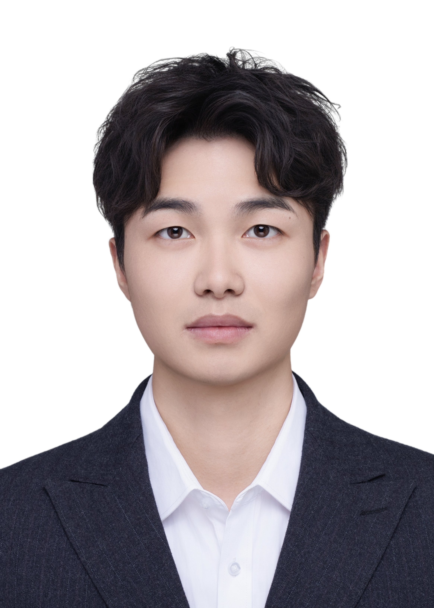
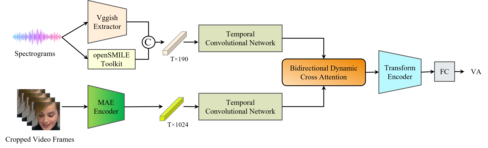
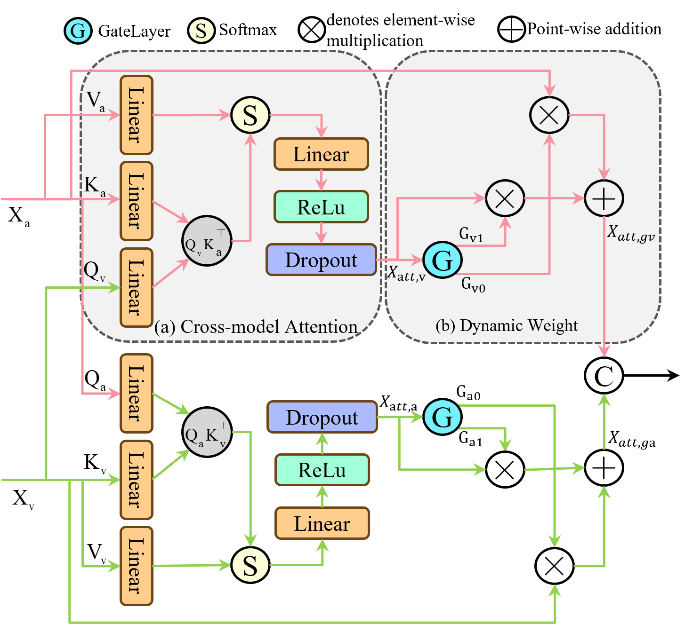
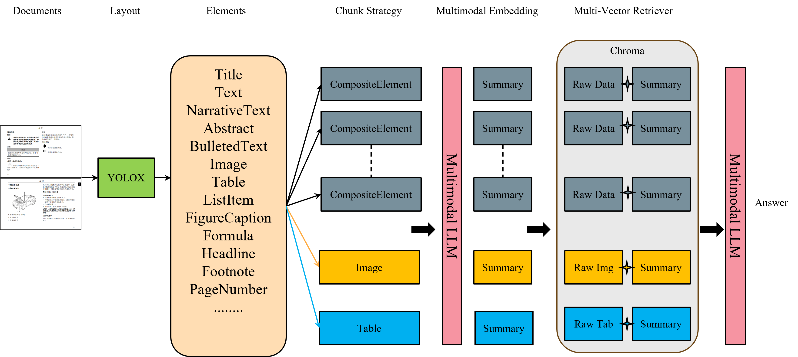

# Resume
📧 **邮箱**：1023010418@njupt.edu.cn | 📞 **电话**：+86 15212147511

面试官您好，我是 **梁宇恒**，就读南京邮电大学信号与信息处理专业，在智能信息处理与通信技术省高校重点实验室（智通实验室），研究生期间获得研究生学业一等奖学金。

科研方面，主要研究方向为**多模态情感识别**，所提出方法在2025年第八届CVPRworkshop国际竞赛中获得**第六名**(全球75支队伍)，论文被收录CVPRworkshop。同时以第一作者身份发表多模态情感识别相关成果论文**3篇**。

项目实践方面，有过两段AI算法实习经历，熟悉主流的深度学习框架（PyTorch）、编程语言（Python/C++）、开发工具链（Linux、Shell、Docker），能够独立完成从方法设计、训练优化、微调到部署上线的完整流程。具备良好的问题分析能力、说明文档撰写能力、部门协作能力。

本人衷心热爱人工人工智能领域研究与实践，具备扎实的**计算机视觉**、**多模态大模型**、**多模态RAG**等实践经验，具备从理论研究到工程化落地的能力链。下面是我科研成果与实践项目的详细说明，期待与您进一步沟通。

---

## 项目经历 
### **多模态情感识别算法(研究生课题)-国家自然基金项目** | 2024.09-至今
- **项目描述**:
情绪识别在加强人机交互和监测心理健康方面发挥着至关重要的作用。针对现有Valence-Arousal (VA) 情感识别任务中如何有效提取能反映情绪细微变化的判别特征，以及如何对多模态特征在空间和时间维度上的分布差异进行建模和调整，以充分利用模态之间的互补信息。设计了一种结合视觉与音频双模态信息的动态交叉注意力融合模型。
- **模型综述**：如下图所示，框架整合了视觉和音频特征，通过`TCN`模块对每种模态中的时间动态和上下文信息进行建模，然后利用双向动态交叉模型注意模块（BDCA），自适应地捕捉模态之间的协同和互补关系，最后将融合后的特征经过`Transformers`，进一步提取多种尺度的深度语境表征。

- **MAE Encoder模块**:
特征提取是多模态情感识别的基础，对模型表示原始情感数据的能力有重大影响。(待补充)
<!--  -->

- **Bidirectional Dynamic Cross-model Attention模块**:
(待补充, 图片需要调整)

---

### **基于Mamba的连续情感识别算法（第八届 ABAW 竞赛）**
- **项目介绍**：针对Valence-Arousal Estimation Challenge任务, 聚焦于多模态情感与行为分析任务。对视频中的人脸序列进行连续效价(Valence)与唤醒度(Arousal)预测，评估指标为 Concordance Correlation Coefficient (CCC)。
- **技术方案**: 
    - 采用 MAE (Masked Autoencoder) 提取高维视觉特征，并通过部分参数冻结策略增强泛化能力；
    - 引入 Temporal Convolutional Network (TCN) 建模短期依赖，捕捉局部动态信息；
    - 融合 Mamba (State Space Model) 进行长序列建模，实现全局情感趋势捕捉，同时兼顾计算效率与稳定性；
- **成果表现**: 
    - 在 Aff-Wild2 数据集 上，测试集平均 CCC = 0.458，显著优于官方 Baseline。
    - 全球共有75支队伍参加, 获得第6名的成绩, 提出的方法被`CVPR 2025 Workshop`收录, 四个月论文被引用4次, 代码仓3个star。

---

## **学术成果**
1. 📄 **Mamba-VA: A Mamba-based Approach for Continuous Emotion Recognition in Valence-Arousal Space**
    - 第一作者, Conference on Computer Vision and Pattern Recognition Workshops(CVPRw)已发表
    - [查看论文](./papers/Mamba-VA.pdf) 
    - 第八届 ABAW VA Estimation Challenge 提交队伍名称：Charon
    - [排行榜](https://affective-behavior-analysis-in-the-wild.github.io/8th/)
    - [代码仓](https://github.com/YuhengRR/Charon)

2. 📄 **LightMamba: A Multimodal Audio-Visual Framework for Continuous Emotion Recognition**
    - 第一作者, 2025 China Automation Congress(CAC)已录用
    - [查看论文](./papers/LightMamba.pdf)

3. 📄 **Enhancing Audio-Visual Affective Analysis via Bidirectional Dynamic Cross-Modal Attention and Masked Autoencoding**
    - 第一作者, 2025 Wireless Communications and Signal Processing (WCSP)在投
    - [查看论文](./papers/BidirectionalDynamicCross-ModalAttention.pdf)

---

## 实习经历 
### 鼎捷数智股份有限公司(南京研发中心)-AI算法工程师 | 2025.05-2025-09
#### 基于大模型的复杂工程图纸解析
图(框架图)
- **项目简介**：通过`YOLOv11`模型对工程图纸中的剖面图、工装图、刻字图/内容、压力图、文本块、表格块、切面图8个类别进行版面检测,对于不同类别通过微调后的Nanonets-OCR-s模型, 进行相应的分析总结.
- **技术栈**: lableme->YOLOv11->Qwen2.5-vl->Nanonets-OCR-s->Llama Factory->
- **主要工作**：
  - 版面解析阶段, 不同类别的检测准确率在96%左右
  - 微调 Nanonets-OCR-s，实现表格和文字检测准确率 ~92%
- **项目难点**：通过Flask上线部署到公司自研IndepthAI平台.
- **个人收获**: 通过方法调研, 确定技术路线, 对版面检测模型进行多次迭代优化, 以及对剖面图、工装图、刻字图/内容、压力图通过大模型微调, 能够详细对不同类别的图片进行总结, 并且能够精准提取相应的参数信息.

---

#### 多模态 RAG 问答系统

- **项目简介**：针对上汽公司的汽车使用与保养的PDF，Image，office等文档，以Langchain为基础框架，Qwen2.5-VL为内核LLM，构建多模态RAG系统。

本项目旨在构建一个支持交互文本、表格和图片的多模态 RAG 问答系统。通过`Unstructured`解析 PDF 文档，抽取多模态元素并结合`Ollama LLM（Llama2、Qwen2.5-VL）`生成中文摘要，实现对文本和图像的统一语义表示。采用 `Chroma`向量库与`MultiVectorRetriever` 完成摘要检索与原文回溯，支持多模态统一问答与高效信息定位。系统主要应用于汽车使用与保养手册，能够快速回答用户关于保养步骤、零部件信息及操作流程的问题，实现文档内容智能检索与辅助决策。  
- **技术栈**：Unstructured/marker、Ollama、LangChain、Chroma、Tesseract OCR、Falsk
- **主要工作**：
  - 基于 Unstructured 完成 PDF 文档解析，抽取文本、表格及图片元素，实现结构化数据处理与统一索引。
  - 使用 Ollama LLM（Llama2、Qwen2.5-VL）生成中文文本和图片摘要，支持扫描件 OCR 与复杂表格图像内容解析。  
  - 构建 Chroma 向量库 + MultiVectorRetriever，实现“摘要向量检索 + 原文/路径回溯”，支持文本、表格和图片的统一多模态问答。
  - 上线部署，能够准确回答文档中二维码、表格及图片内容等问题。
- **项目难点**：结构化数据提取, 文本和图片生成摘要提示词, 向量库构建, 检索策略
- **个人收获**: 掌握了多模态信息抽取与 RAG 问答系统构建的全流程，实现跨模态知识检索与高效问答。提升了 LLM 调用、向量检索优化以及大规模文档处理能力，积累了复杂系统工程实践经验。

### 深研人工智能(深圳)有限公司-初级算法工程师 | 2024.07-2024.09
#### 基于YOLOv5道路病害检测
- **项目描述**: 基于 PyTorch 框架，使用 YOLOv5 架构实现对多类道路病害（裂缝、坑槽、车辙、隆包、标线模糊）的自动识别与定位，提升道路维护的智能化水平。
- **主要工作**: 收集道路病害图片并使用FiftyOne进行标注; 完成模型搭建与训练, 通过实验对比不同超参数配置，有效提升检测精度到85%。
- **项目难点**: 无人机拍摄的图片存在树枝、阴影投影到道路表面，容易引起模型误判为裂缝类病害。
- **个人收获**: 提升了在真实场景下进行数据清洗、建模与调优的能力，具备从数据分析到系统落地的完整实践经验。

---

## 专业技能
- 熟悉Python/C++/C语言，熟练使用Shell等脚本工具语言，掌握计算机原理、数据结构与算法等核心基础理论。
- 熟练使用Linux开发环境以及Docker、CMake、Git等开发工具。
- 

---

## 个人评价

---

> 从理论到工程，我的目标是让研究走向真实应用。
